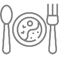

#  PartCoffee

  
  
  
  
  

> Status do Projeto: :white_check_mark: (concluido) | :warning: (em desenvolvimento) | :x: (não iniciada)

### Tópicos
:small_blue_diamond: [Descrição do Projeto](#writing_hand-descrição-do-projeto) :white_check_mark:

:small_blue_diamond: [Objetivo](#dart-objetivo) :white_check_mark:

:small_blue_diamond: [Funcionalidades](#video_game-funcionalidades) :white_check_mark:

:small_blue_diamond: [Captura de Tela](#camera_flash-captura-de-tela) :white_check_mark:

:small_blue_diamond: [Tecnologias Utilizadas](#hammer_and_wrench-tecnologias-utilizadas) :white_check_mark:

:small_blue_diamond: [Disponível em](#globe_with_meridians-disponível-em) :white_check_mark:

## :writing_hand: Descrição do Projeto 

 O site foi desenvolvido durante a maratona da Rocketseat e se trata de um cardápio digital. Seu principal objetivo é modernizar o acesso aos cardápios de restaurantes e lanchonetes, tornando-o mais prático e acessível. Com este site, os clientes podem visualizar o cardápio completo apenas escaneando um QR-Code, eliminando a necessidade de cardápios impressos e promovendo uma experiência mais ágil e sustentável. 

## :dart: Objetivo 

 O objetivo do projeto é facilitar o acesso aos cardápios de restaurantes e lanchonetes, proporcionando uma experiência digital prática e moderna. Ao utilizar QR-Codes, o projeto visa reduzir a dependência de materiais impressos, contribuindo para a sustentabilidade e otimizando a interação dos clientes com os estabelecimentos. 

## :video_game: Funcionalidades 
- Acesso via QR-Code: Os clientes podem acessar o cardápio digital simplesmente escaneando um QR-Code com seus dispositivos móveis.
- Visualização de Cardápio: O site exibe o cardápio completo de forma organizada e fácil de navegar, permitindo que os clientes visualizem todas as opções de refeições e bebidas disponíveis.
- Praticidade e Sustentabilidade: Elimina a necessidade de cardápios impressos, promovendo uma experiência mais prática e ecológica.

## :camera_flash: Captura de Tela 

  

## :hammer_and_wrench: Tecnologias Utilizadas 
- HTML5
- CSS3

## :globe_with_meridians: Disponível em 
https://partcoffee.netlify.app/

## Licença
The [MIT License]() (MIT)

Copyright :copyright: 2022 - Tiago Tomé
